# Multi-Agent AI Platform — Detailed Architecture

This document is the master architecture reference for the Multi-Agent AI Platform. It aligns with the project specification: **business app first**, then **document AI**, then **multi-agent layer**, then **production on AWS**.

Sections **21–33** lock V1 business rules, API contracts, extraction behavior, auth sequencing, ADRs, and go-live ops so implementers do not invent conflicting defaults.

---

## Table of Contents

1. [High-Level System View](#1-high-level-system-view)
2. [Logical Architecture (Layers)](#2-logical-architecture-layers)
3. [Repository / Code Architecture](#3-repository--code-architecture)
4. [Data Architecture](#4-data-architecture)
5. [Backend Module Architecture](#5-backend-module-architecture)
6. [API Architecture](#6-api-architecture)
7. [Frontend Architecture](#7-frontend-architecture)
8. [Document Processing Architecture](#8-document-processing-architecture)
9. [AI / Agent Architecture (V1)](#9-ai--agent-architecture-v1)
10. [Report Generation Architecture](#10-report-generation-architecture)
11. [Security Architecture](#11-security-architecture)
12. [Background Job Architecture](#12-background-job-architecture)
13. [Deployment Architecture](#13-deployment-architecture)
14. [CI/CD Architecture](#14-cicd-architecture)
15. [Observability Architecture](#15-observability-architecture)
16. [End-to-End User Journeys](#16-end-to-end-user-journeys)
17. [Recommended Implementation Phases](#17-recommended-implementation-phases)
18. [Architecture Decisions to Make Early](#18-architecture-decisions-to-make-early)
19. [Non-Negotiable Architecture Rules](#19-non-negotiable-architecture-rules)
20. [Minimal V1 Architecture Summary](#20-minimal-v1-architecture-summary)
21. [Business Rules (V1)](#21-business-rules-v1)
22. [Data Model Completeness](#22-data-model-completeness)
23. [API Conventions](#23-api-conventions)
24. [Document Extraction Spec](#24-document-extraction-spec)
25. [Authentication Sequencing](#25-authentication-sequencing)
26. [Report Type Catalog](#26-report-type-catalog)
27. [Chat API Contract](#27-chat-api-contract)
28. [Job Reliability](#28-job-reliability)
29. [Architecture Decision Records](#29-architecture-decision-records)
30. [Local Development Stack](#30-local-development-stack)
31. [Frontend UX Conventions](#31-frontend-ux-conventions)
32. [Testing & Seed Data](#32-testing--seed-data)
33. [Go-Live Ops Checklist](#33-go-live-ops-checklist)

---

## 1. High-Level System View

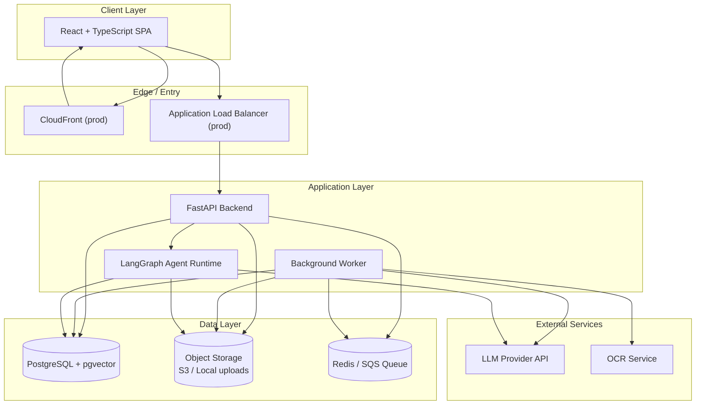

### Core idea: three systems in one product

| System | Purpose | Source of truth |
|--------|---------|-----------------|
| **Business Application** | CRUD, billing, deliveries | PostgreSQL |
| **Document Intelligence** | PDF → extract → human verify → optional RAG | PostgreSQL + pgvector + S3 |
| **Agent Platform** | Natural language Q&A and reports | Controlled tools over PostgreSQL + RAG |

---

## 2. Logical Architecture (Layers)

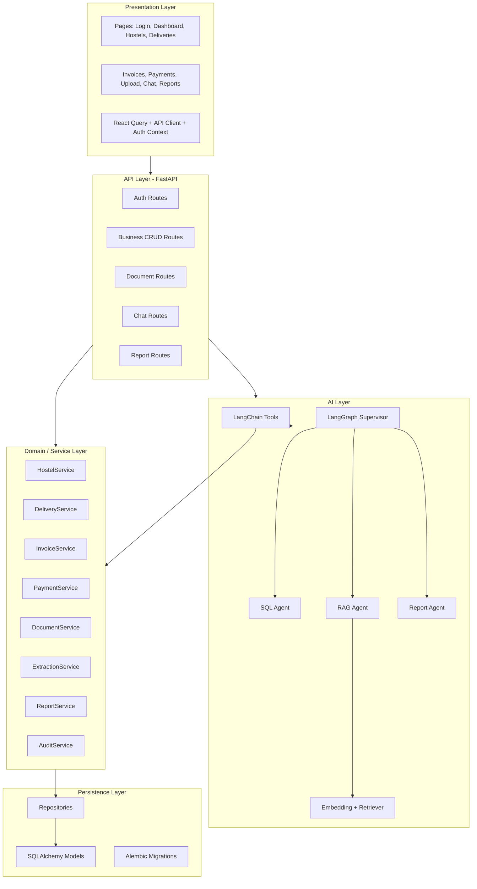

### Layer responsibilities

| Layer | Responsibility | Must NOT do |
|-------|----------------|-------------|
| **Frontend** | UI, forms, validation, polling job status | Business calculations, direct DB access |
| **API** | HTTP, auth checks, request validation | Complex business logic inline in routes |
| **Services** | Business rules, transactions, orchestration | Raw SQL everywhere, LLM calls in every service |
| **Repositories** | DB queries, persistence | Business policy decisions |
| **Agents** | Intent routing, tool selection, answer formatting | Direct DB writes, uncontrolled SQL |
| **Workers** | Long-running PDF/OCR/embedding jobs | Block HTTP requests |

---

## 3. Repository / Code Architecture

```
multi-agent-system/
├── frontend/
│   ├── src/
│   │   ├── api/                 # Axios/fetch wrappers
│   │   ├── components/          # Shared UI
│   │   ├── features/
│   │   │   ├── auth/
│   │   │   ├── hostels/
│   │   │   ├── deliveries/
│   │   │   ├── invoices/
│   │   │   ├── payments/
│   │   │   ├── documents/
│   │   │   ├── chat/
│   │   │   └── reports/
│   │   ├── hooks/
│   │   ├── pages/
│   │   ├── routes/
│   │   ├── types/
│   │   └── utils/
│   └── package.json
│
├── backend/
│   ├── app/
│   │   ├── main.py              # FastAPI app entry
│   │   ├── api/
│   │   │   ├── deps.py          # Auth, DB session deps
│   │   │   └── v1/
│   │   │       ├── auth.py
│   │   │       ├── hostels.py
│   │   │       ├── deliveries.py
│   │   │       ├── invoices.py
│   │   │       ├── payments.py
│   │   │       ├── documents.py
│   │   │       ├── chat.py
│   │   │       └── reports.py
│   │   ├── core/
│   │   │   ├── config.py        # Settings from env
│   │   │   ├── security.py      # JWT/password hashing
│   │   │   └── logging.py
│   │   ├── database/
│   │   │   ├── session.py
│   │   │   └── base.py
│   │   ├── models/              # SQLAlchemy ORM
│   │   ├── schemas/             # Pydantic request/response
│   │   ├── repositories/        # DB access only
│   │   ├── services/            # Business logic
│   │   ├── documents/
│   │   │   ├── storage/         # Local/S3 abstraction
│   │   │   ├── extraction/      # PyMuPDF + OCR
│   │   │   └── llm_extract.py   # Structured invoice extraction
│   │   ├── rag/
│   │   │   ├── chunker.py
│   │   │   ├── embedder.py
│   │   │   └── retriever.py
│   │   ├── agents/
│   │   │   ├── tools/           # LangChain tools
│   │   │   ├── supervisor/
│   │   │   ├── sql_agent/
│   │   │   ├── rag_agent/
│   │   │   └── report_agent/
│   │   ├── reports/
│   │   │   ├── excel.py
│   │   │   ├── word.py
│   │   │   └── pdf.py
│   │   └── workers/
│   │       ├── celery_app.py    # or SQS consumer
│   │       └── tasks.py
│   ├── alembic/
│   ├── tests/
│   ├── pyproject.toml           # Dependencies (uv); lock with uv.lock
│   └── uv.lock
│
├── docker/
├── docs/
│   └── fixtures/                # Sample PDFs for extraction tests
├── .github/workflows/
├── docker-compose.yml
├── .env.example
└── README.md
```

---

## 4. Data Architecture

### 4.1 Database domains

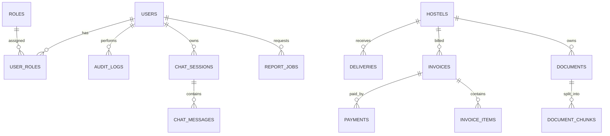

### 4.2 Core tables

| Table | Purpose | Key fields |
|-------|---------|------------|
| `users` | App users | email, password_hash, active |
| `roles`, `user_roles` | RBAC | Owner, Accountant, Delivery Manager, Viewer |
| `hostels` | Master data | name, code, rate, contact, active |
| `deliveries` | Daily supply | hostel_id, date, morning/evening qty, total |
| `invoices` | Monthly billing | hostel_id, month, totals, payment_status |
| `invoice_items` | Line items | invoice_id, description, qty, amount |
| `payments` | Payments | invoice_id, amount, date, method |
| `documents` | Uploaded files | storage_key, type, processing_status, extracted_payload |
| `document_chunks` | RAG vectors | document_id, chunk_text, embedding |
| `audit_logs` | Immutable audit | entity_type, old/new values |
| `chat_sessions`, `chat_messages` | Conversation history | thread_id, role, content |
| `report_jobs` | Generated reports | report_type, format, status, storage_key |

### 4.3 Suggested core fields

```
hostels:
  id, name, code, address, contact_name, phone, default_rate_per_liter,
  active, created_at, updated_at

deliveries:
  id, hostel_id, delivery_date, morning_quantity, evening_quantity,
  total_quantity, rate_per_liter, notes, created_by, created_at

invoices:
  id, hostel_id, invoice_number, billing_month, period_start, period_end,
  total_quantity, subtotal, tax, adjustments, total_amount,
  payment_status, due_date, source_document_id, created_at

payments:
  id, invoice_id, hostel_id, amount, payment_date, payment_method,
  reference_number, notes, created_at

documents:
  id, hostel_id, file_name, storage_key, mime_type, document_type,
  processing_status, extraction_status, extracted_payload (JSONB),
  extraction_issues (JSONB), content_hash, uploaded_by, created_at,
  confirmed_at, confirmed_by, rejected_at, rejected_by, rejection_reason

document_extractions:   # optional dedicated table if payload grows large
  id, document_id, schema_version, payload (JSONB), confidence,
  validation_errors (JSONB), created_at
```

See [Section 22](#22-data-model-completeness) for enums, unique constraints, and indexes.

### 4.4 Data truth rules

```
┌─────────────────────────────────────────────────────────────┐
│                    DATA CLASSIFICATION                       │
├──────────────────────┬──────────────────────────────────────┤
│ EXACT BUSINESS TRUTH │ PostgreSQL only                      │
│                      │ deliveries, invoices, payments, rates│
├──────────────────────┼──────────────────────────────────────┤
│ DOCUMENT KNOWLEDGE   │ pgvector + original PDF in storage   │
│                      │ contracts, terms, unstructured notes │
├──────────────────────┼──────────────────────────────────────┤
│ AI DRAFT DATA        │ Temporary until human confirms       │
│                      │ extraction_status = pending/rejected │
├──────────────────────┼──────────────────────────────────────┤
│ CHAT MEMORY          │ Context only, not financial truth    │
└──────────────────────┴──────────────────────────────────────┘
```

**Core design principle:**

```
Exact quantities, rates, invoices, payments, totals  ->  PostgreSQL / SQL
Contracts, agreements, notes, unstructured PDFs      ->  RAG / pgvector
LLM                                                    ->  understands language, chooses tools
LangGraph                                              ->  orchestrates workflow and routing
Python                                                 ->  deterministic calculations and file generation
```

---

## 5. Backend Module Architecture

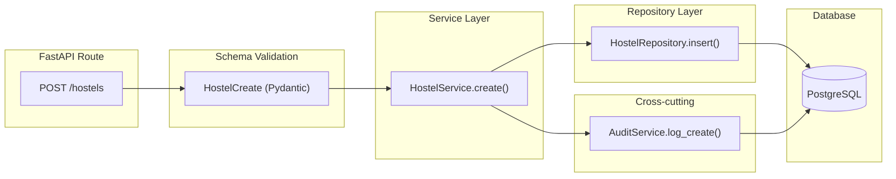

Every business module follows the same pattern:

```
Route → Pydantic Schema → Service → Repository → PostgreSQL
                              ↓
                         AuditService
```

---

## 6. API Architecture

All versioned business APIs live under **`/api/v1`**. See [Section 23](#23-api-conventions) for pagination, errors, and filters. Auth enforcement follows [Section 25](#25-authentication-sequencing).

### 6.1 API groups

| Group | Endpoints | Auth (after Phase 12 hardening) |
|-------|-----------|----------------------------------|
| **Health** | `GET /health`, `GET /health/ready` | Public |
| **Auth** | login, logout, refresh, me | Mixed |
| **Hostels** | CRUD | Protected + RBAC |
| **Deliveries** | CRUD | Protected + RBAC |
| **Invoices** | CRUD | Protected + RBAC |
| **Payments** | CRUD | Protected + RBAC |
| **Documents** | upload, get, confirm, reject | Protected + RBAC |
| **Chat** | `POST /api/v1/chat` | Protected + RBAC |
| **Reports** | create, status, download | Protected + RBAC |

### 6.2 Core REST endpoints

```
GET    /health
GET    /health/ready

POST   /api/v1/auth/login
POST   /api/v1/auth/logout
POST   /api/v1/auth/refresh
GET    /api/v1/auth/me

POST   /api/v1/hostels
GET    /api/v1/hostels
GET    /api/v1/hostels/{id}
PUT    /api/v1/hostels/{id}
DELETE /api/v1/hostels/{id}

POST   /api/v1/deliveries
GET    /api/v1/deliveries
GET    /api/v1/deliveries/{id}
PUT    /api/v1/deliveries/{id}

POST   /api/v1/invoices
GET    /api/v1/invoices
GET    /api/v1/invoices/{id}

POST   /api/v1/payments
GET    /api/v1/payments

POST   /api/v1/documents/upload
GET    /api/v1/documents/{id}
POST   /api/v1/documents/{id}/confirm
POST   /api/v1/documents/{id}/reject

POST   /api/v1/chat
POST   /api/v1/reports
GET    /api/v1/reports/{id}
GET    /api/v1/reports/{id}/download
```

### 6.3 Example request flow — create hostel

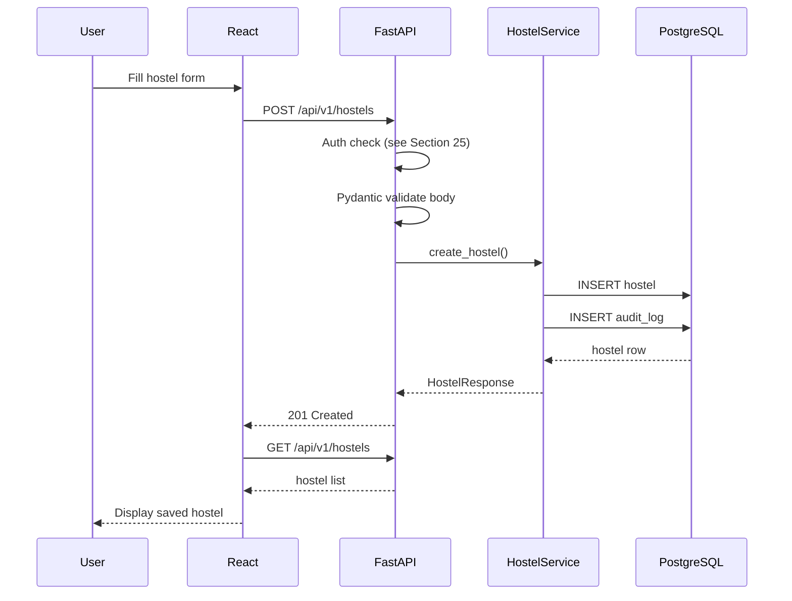

**First milestone:** React Hostel Form → FastAPI → PostgreSQL → retrieve → display. Do not proceed to agents until this works.

---

## 7. Frontend Architecture

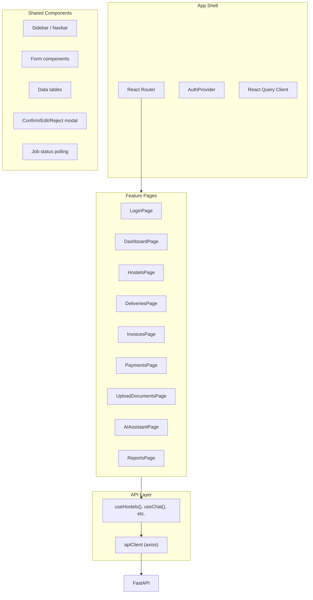

### Page responsibilities

| Page | Main actions |
|------|--------------|
| **Login** | Authenticate, store token |
| **Dashboard** | KPIs: hostels, today supply, revenue, pending payments |
| **Hostels** | CRUD hostel master data |
| **Deliveries** | Record morning/evening quantities |
| **Invoices** | View/create monthly invoices |
| **Payments** | Record and track payments |
| **Upload Documents** | Upload PDF, show processing status |
| **AI Assistant** | Chat UI with thread memory |
| **Reports** | Request Excel/Word/PDF exports |
| **Settings** | User/profile/config |

### Technology stack

| Layer | Technology |
|-------|------------|
| Framework | React + TypeScript |
| Build tool | Vite |
| Styling | Tailwind CSS |
| Server state | React Query |
| Routing | React Router |

---

## 8. Document Processing Architecture

This is a **pipeline**, not an agent in V1.

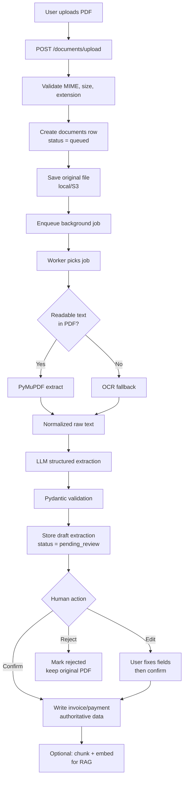

### Document states

| Status | Meaning |
|--------|---------|
| `queued` | Uploaded, waiting for worker |
| `processing` | Worker extracting text |
| `extracted` | LLM output ready for review |
| `pending_review` | Waiting for human confirm/edit/reject |
| `confirmed` | Authoritative data written |
| `rejected` | User rejected extraction |
| `failed` | OCR/LLM/system failure |

### LLM structured extraction example

```json
{
  "hostel_name": "Sai Boys Hostel",
  "billing_month": "2026-07",
  "invoice_number": "INV-1001",
  "total_quantity": 1250,
  "rate_per_liter": 60,
  "total_amount": 75000,
  "due_date": "2026-08-10"
}
```

### Storage architecture

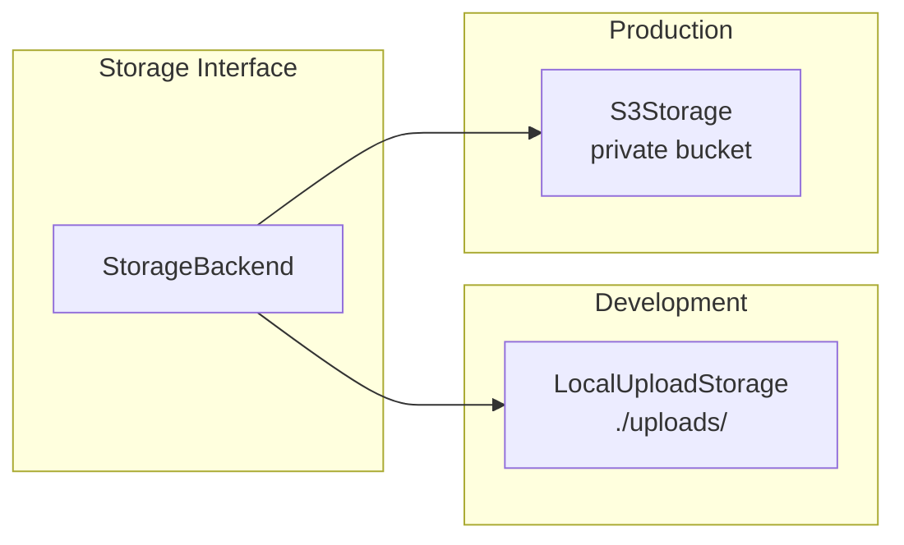

Configuration:

```
STORAGE_BACKEND=local | s3
LOCAL_UPLOAD_DIR=./uploads
S3_BUCKET_DOCUMENTS=...
```

---

## 9. AI / Agent Architecture (V1)

### 9.1 Agent count

V1 includes **4 agents**:

| # | Agent | Role |
|---|-------|------|
| 1 | **Supervisor / Router** | Orchestrates and routes requests |
| 2 | **SQL Agent** | Exact business data from PostgreSQL |
| 3 | **RAG Agent** | Document/contract questions |
| 4 | **Report Agent** | Excel, Word, PDF generation |

### 9.2 Agent topology

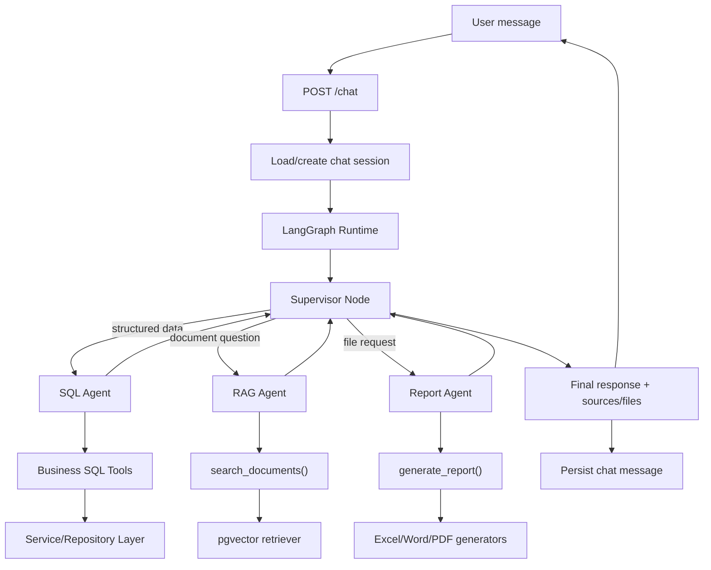

### 9.3 Agent responsibilities

#### Supervisor / Router

- Classify user intent
- Preserve conversation context
- Route structured-data questions to SQL Agent
- Route document questions to RAG Agent
- Route file/report requests to Report Agent
- Handle mixed requests with multiple controlled steps
- Return concise final response with sources when appropriate

#### SQL Agent

**Example questions:**
- "How much did Sai Hostel receive in July?"
- "Which hostels have unpaid invoices?"
- "What was July revenue?"
- "Who are the top 10 debtors?"

**Tasks:**
- Call controlled LangChain tools (not free database access)
- Run calculations in SQL/Python
- Return factual answers from verified PostgreSQL data

#### RAG Agent

**Example questions:**
- "What are Sai Hostel's payment terms?"
- "What does the agreement say about annual rate increases?"
- "What are the late-payment terms?"

**Tasks:**
- Search embedded document chunks in pgvector
- Retrieve most relevant passages
- Produce grounded answer from retrieved chunks

#### Report Agent

**Example requests:**
- "Export July pending payments to Excel"
- "Create Sai Hostel statement as PDF"
- "Create a monthly management summary in Word"

**Tasks:**
- Fetch verified SQL data
- Generate Excel (openpyxl/pandas), Word (python-docx), or PDF (ReportLab)
- Store file and return download link

### 9.4 LangChain tools (controlled, not free SQL)

```python
get_hostel(hostel_name)
get_deliveries(hostel_id, start_date, end_date)
get_invoice(invoice_number)
get_hostel_invoices(hostel_id, month)
get_pending_payments(month=None)
get_monthly_revenue(month)
get_top_debtors(month=None, limit=10)
search_documents(hostel_id, query)
generate_report(report_type, filters, output_format)
```

**Design rule:** Tools call services/repositories with parameterized queries. The LLM never gets raw SQL write access.

### 9.5 LangGraph state model

```python
# Conceptual graph state
{
  "thread_id": "uuid",
  "user_id": "uuid",
  "messages": [...],
  "intent": "sql | rag | report | mixed",
  "selected_agent": "sql_agent",
  "context_entities": {
    "hostel_id": "...",
    "month": "2026-07"
  },
  "tool_results": [...],
  "final_response": "...",
  "attachments": []
}
```

This enables follow-ups like:

```
User: "Show Sai Hostel July invoice"
User: "What about August?"
```

The supervisor keeps `hostel_id` in state and resolves August for the same hostel.

### 9.6 RAG architecture

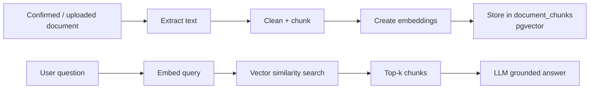

**Routing rule:**

| Question type | Route |
|---------------|-------|
| "How much was delivered in July?" | SQL Agent |
| "What do payment terms say?" | RAG Agent |
| "Export July billing Excel" | Report Agent |

### 9.7 V2 agents (deferred until V1 is stable)

| Agent | Likely task |
|-------|-------------|
| Payment Reminder Agent | Send reminders for overdue invoices |
| Automatic Invoice Agent | Auto-generate invoices from deliveries |
| Demand Forecast Agent | Predict future demand |
| Inventory Agent | Track/manage inventory |
| WhatsApp Agent | Notifications via WhatsApp |
| Email Agent | Invoices, reminders, reports via email |
| Route Optimization Agent | Optimize delivery routes |
| Customer Support Agent | Handle hostel/customer queries |
| Analytics Agent | Trends, dashboards, insights |

Also planned for V2: voice interface, mobile application, automated anomaly detection.

---

## 10. Report Generation Architecture

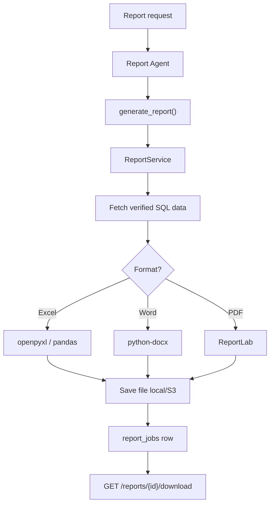

| Format | Library | Use case |
|--------|---------|----------|
| Excel | openpyxl / pandas | Detailed tables, billing, pending payments |
| Word | python-docx | Management summaries, letters, statements |
| PDF | ReportLab | Printable statements and reports |

Reports must always be generated from **verified PostgreSQL data**, never from LLM guesses.

---

## 11. Security Architecture

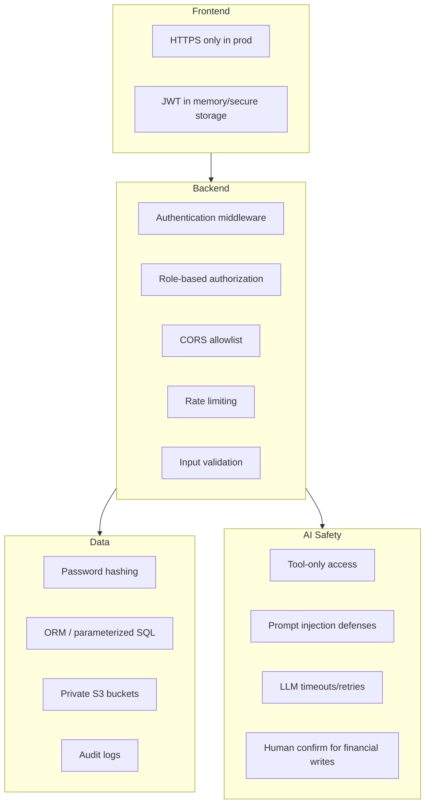

### Roles

| Role | Permissions |
|------|-------------|
| **Owner** | Full access |
| **Accountant** | Invoices, payments, reports, document confirm |
| **Delivery Manager** | Deliveries, hostels read/update |
| **Viewer** | Read-only dashboards and reports |

### Security checklist

- Secure password hashing
- JWT or secure server-side session authentication
- Role-based access control on every protected endpoint
- Private S3 objects with controlled download access
- File type and file size validation
- Parameterized SQL / ORM usage
- Rate limiting for public/auth/chat endpoints
- CORS restricted to approved frontend origins
- Secrets only through environment variables (local) and Secrets Manager (production)
- LLM prompt-injection defenses: retrieved document instructions must not override system policies
- Restrict agent tools by role and operation
- Timeouts, retries, and graceful LLM/provider failure handling

### Audit logging

```
audit_logs:
  id
  user_id
  action
  entity_type
  entity_id
  old_values
  new_values
  timestamp
  request_id / correlation_id
```

---

## 12. Background Job Architecture

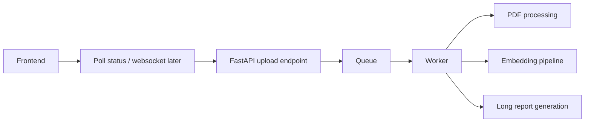

| Environment | Queue | Worker |
|-------------|-------|--------|
| **Local dev** | Redis | Celery worker |
| **Production** | AWS SQS | ECS Fargate worker service |

### Job types

- `process_document` — PDF text extraction, OCR, LLM structured extraction
- `create_embeddings` — Chunk and embed documents for RAG
- `generate_report` — Long-running report generation

**Rule:** Do not process a batch of PDFs inside a long browser request.

Reliability details (retries, DLQ, limits, idempotency) are in [Section 28](#28-job-reliability).

---

## 13. Deployment Architecture

### 13.1 Local development

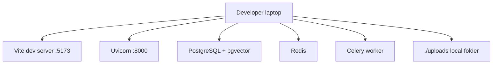

`docker compose up` should run:

- frontend
- backend
- postgres (+ pgvector)
- redis
- worker

### 13.2 AWS production

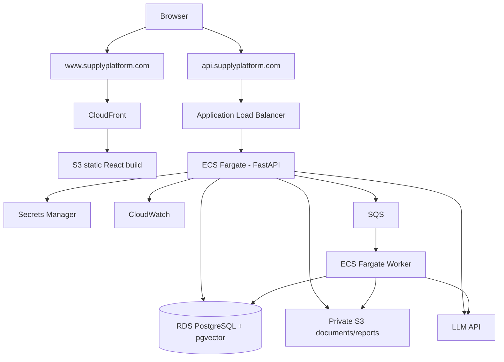

### 13.3 AWS service map

| Service | Use |
|---------|-----|
| **S3** | PDFs, generated reports, frontend build |
| **CloudFront** | Serve React app |
| **ECR** | Docker images |
| **ECS Fargate** | API + workers |
| **RDS PostgreSQL** | Main database with pgvector |
| **SQS** | Async jobs |
| **Secrets Manager** | DB creds, JWT secret, LLM keys |
| **CloudWatch** | Logs, metrics, alarms |
| **ACM** | HTTPS certificates |
| **Route 53** | DNS |

### 13.4 Environments

```
DEV
  - laptop
  - local Postgres
  - local file storage
  - test LLM key

STAGING
  - cloud environment
  - test/sanitized data
  - production-like deployment

PRODUCTION
  - real users
  - real business data
  - backups, alarms, restricted access
```

### 13.5 Production networking

- Expose only frontend and API entry points
- Keep RDS private
- Security groups: database accepts connections only from backend/worker
- HTTPS everywhere externally
- S3 document buckets must be private

---

## 14. CI/CD Architecture

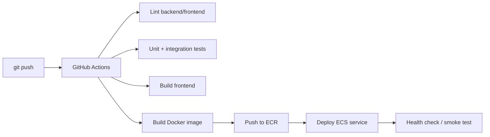

Deployment must **fail closed**: if tests fail, no deploy.

---

## 15. Observability Architecture

| Signal | What to monitor |
|--------|-----------------|
| **API metrics** | Latency, 4xx/5xx, auth failures |
| **Worker metrics** | Queue depth, failed jobs |
| **PDF pipeline** | OCR success/failure, extraction failures |
| **LLM usage** | Tokens, latency, cost |
| **Agents** | Route chosen, tool calls, misrouting |
| **Database** | Connections, storage, slow queries |
| **Business ops** | Pending reviews, unpaid invoices, upload failures |

### Tools

- **CloudWatch** — infrastructure and application logs, metrics, alarms
- **LangSmith** — LangChain/LangGraph execution traces

### Backup and recovery

- Enable RDS automated backups and define retention
- Consider S3 versioning/lifecycle rules for business documents
- Document and test database restoration procedures
- Do not rely on LLM/vector index as the only copy of business information

---

## 16. End-to-End User Journeys

### Journey A — Daily business operation

```
Login → Dashboard → Add delivery → View hostel invoice → Record payment
```

Uses only CRUD + SQL, no agents required.

### Journey B — PDF to verified invoice

```
Upload PDF → Worker extracts → User reviews → Confirm → Invoice saved
```

Uses document pipeline + human verification.

### Journey C — Ask AI a business question

```
Open AI Assistant → "How much did Sai Hostel receive in July?"
→ Supervisor → SQL Agent → get_deliveries tool → answer
```

### Journey D — Ask about contract terms

```
"What are Sai Hostel late payment terms?"
→ Supervisor → RAG Agent → vector search → grounded answer
```

### Journey E — Generate report

```
"Export July pending payments to Excel"
→ Supervisor → Report Agent → SQL data → Excel file → download
```

### Production live user flow

```
1. User opens https://www.supplyplatform.com
2. User logs in
3. Dashboard loads verified business data
4. User uploads monthly PDF(s)
5. Backend stores originals and queues processing
6. Worker extracts text/OCR
7. LLM returns structured data
8. Pydantic validates output
9. User confirms/edits/rejects
10. Confirmed data is stored in PostgreSQL
11. User asks a natural-language question
12. LangGraph routes it:
    - SQL Agent for exact business data
    - RAG Agent for document knowledge
    - Report Agent for file generation
13. Tool retrieves verified data
14. LLM presents the answer
15. Requested Excel/Word/PDF is generated and returned
16. Logs, traces, and audit records are retained
```

---

## 17. Recommended Implementation Phases

```mermaid
flowchart LR
    P1["Phase 1\nScaffold + Health"] --> P2["Phase 2\nPostgreSQL + Hostels CRUD"]
    P2 --> P3["Phase 3\nDeliveries/Invoices/Payments"]
    P3 --> P4["Phase 4\nFrontend pages + dashboard"]
    P4 --> P5["Phase 5\nPDF upload + storage"]
    P5 --> P6["Phase 6\nOCR + LLM extraction"]
    P6 --> P7["Phase 7\nHuman confirm UI"]
    P7 --> P8["Phase 8\nRAG embeddings"]
    P8 --> P9["Phase 9\nLangChain tools"]
    P9 --> P10["Phase 10\nLangGraph agents"]
    P10 --> P11["Phase 11\nReports"]
    P11 --> P12["Phase 12\nAuth/RBAC/Audit"]
    P12 --> P13["Phase 13\nDocker + CI/CD"]
    P13 --> P14["Phase 14\nAWS production"]
```

### Detailed implementation order

1. Repository scaffolding and environment configuration
2. FastAPI `/health` endpoint
3. React application and API client
4. PostgreSQL connection + Alembic
5. Hostel model/schema/repository/service/API
6. Hostel React CRUD page
7. Delivery model and CRUD
8. Invoice and payment models/APIs
9. Dashboard queries and UI
10. PDF upload endpoint + document metadata
11. Local file storage abstraction
12. PyMuPDF extraction service
13. OCR fallback interface
14. LLM client abstraction
15. Pydantic structured invoice extraction
16. Human review/confirm/edit/reject UI and APIs
17. pgvector and document chunking/embedding pipeline
18. RAG retriever and search tool
19. LangChain business tools
20. LangGraph state and supervisor/router
21. SQL Agent
22. RAG Agent
23. Report Agent
24. Conversation thread memory
25. Excel generator
26. Word generator
27. PDF generator
28. Authentication (seed owner + JWT — introduce early; harden RBAC in step 29)
29. RBAC and authorization
30. Audit logging
31. Background queue/worker
32. Comprehensive automated tests
33. Dockerfiles + Docker Compose
34. GitHub Actions CI
35. AWS infrastructure/deployment
36. Domain + HTTPS
37. Monitoring + alarms + tracing
38. Backups and recovery procedure
39. Staging acceptance testing
40. Production launch

**Auth sequencing:** Do not leave production APIs open. For local Phase 2–4, either (a) enable JWT with a seeded owner user as soon as hostels land, or (b) gate with `APP_ENV=development` + explicit `ALLOW_UNAUTHENTICATED=true` that is **forbidden** in staging/production. Full role matrix is required before Phase 14. Details in [Section 25](#25-authentication-sequencing).

---

## 18. Architecture Decisions to Make Early

These decisions are **resolved in [Section 29](#29-architecture-decision-records)**. Summary:

| Decision | V1 choice |
|----------|-----------|
| **LLM provider** | OpenAI-compatible API via abstraction; model from `LLM_MODEL` |
| **OCR** | Tesseract locally; interface allows Textract later |
| **Auth** | JWT access + refresh tokens; httpOnly refresh cookie preferred for browser |
| **Queue** | Celery + Redis locally; SQS in AWS |
| **Vector store** | pgvector inside PostgreSQL |
| **File storage** | `StorageBackend` interface: local + S3 |
| **Agent framework** | LangGraph with explicit supervisor node |
| **Frontend state** | React Query for server state; local state for forms |
| **Package management** | Backend: `uv` + `pyproject.toml`; Frontend: npm + lockfile |
| **API prefix** | `/api/v1` for business routes; `/health` unversioned |

---

## 19. Non-Negotiable Architecture Rules

1. PostgreSQL is the **only financial source of truth**
2. AI extraction is **draft until human confirms**
3. Agents use **tools**, not unrestricted DB access
4. RAG is for **documents**, SQL is for **numbers**
5. Reports are generated by **Python libraries from SQL data**
6. Original PDFs are always preserved
7. All important financial changes are **audited**
8. Long tasks run in **workers**, not HTTP requests
9. Secrets never go in git
10. Build the **hostel CRUD vertical slice first**

### Cursor engineering rules

- Do not implement the entire system in one giant change; work phase by phase
- Keep API, service, repository, and database responsibilities separated
- Use typed Pydantic schemas and TypeScript types
- Use database migrations; never depend on manual production schema edits
- Do not allow the LLM to directly mutate arbitrary database records
- Do not use RAG to calculate exact invoice totals
- Do not use conversation memory as authoritative business storage
- Do not hard-code secrets; create `.env.example` with variable names only
- Add logging and meaningful error responses
- Add tests as each module is created
- Financial records extracted by AI require human verification in V1
- Use interfaces/abstractions for storage, LLM, and OCR providers
- Keep the initial agent set to Supervisor + SQL + RAG + Report
- Prefer deterministic Python/SQL for calculations and report generation
- Add idempotency/duplicate detection for document uploads and invoice creation
- Use UTC timestamps internally; present business-local dates in UI

---

## 20. Minimal V1 Architecture Summary

```
React UI
   ↓
FastAPI
   ├── Business modules → PostgreSQL
   ├── Document upload → Worker → OCR/LLM → Human review → PostgreSQL
   ├── RAG → pgvector
   └── Chat → LangGraph
           ├── Supervisor
           ├── SQL Agent
           ├── RAG Agent
           └── Report Agent
Object storage for PDFs/reports
Redis/SQS for async jobs
Docker locally, ECS/RDS/S3 in AWS
```

### Technology stack summary

| Layer | Technology | Purpose |
|-------|------------|---------|
| Frontend | React, TypeScript, Vite, Tailwind CSS, React Query | UI, forms, dashboard, chat, reports |
| Backend | Python, FastAPI, Pydantic, SQLAlchemy, Alembic | APIs, validation, business logic |
| Database | PostgreSQL + pgvector | Structured business data + embeddings |
| AI | LangChain, LangGraph, LLM API | Tools, RAG, routing, agent orchestration |
| Documents | PyMuPDF + OCR | PDF text extraction |
| Reports | pandas/openpyxl, python-docx, ReportLab | Excel, Word, PDF generation |
| Async | Redis/Celery locally; SQS/worker in AWS | Background PDF processing |
| DevOps | Git, GitHub, Docker, Docker Compose, GitHub Actions | Versioning, containers, CI/CD |
| AWS | S3, CloudFront, ECR, ECS Fargate, RDS, SQS, Secrets Manager, CloudWatch | Production infrastructure |

### Suggested environment variables

```
APP_ENV=development
ALLOW_UNAUTHENTICATED=false
DATABASE_URL=postgresql+psycopg://...
JWT_SECRET=...
JWT_ACCESS_TTL_MINUTES=15
JWT_REFRESH_TTL_DAYS=7
LLM_API_KEY=...
LLM_MODEL=...
LLM_BASE_URL=...
EMBEDDING_MODEL=...
STORAGE_BACKEND=local
LOCAL_UPLOAD_DIR=./uploads
MAX_UPLOAD_BYTES=10485760
S3_BUCKET_DOCUMENTS=...
S3_BUCKET_REPORTS=...
AWS_REGION=...
REDIS_URL=...
SQS_QUEUE_URL=...
SQS_DLQ_URL=...
CORS_ORIGINS=http://localhost:5173
BUSINESS_TIMEZONE=Asia/Kolkata
CURRENCY_CODE=INR
LOG_LEVEL=INFO
```

### V1 definition of done

- User can log in
- User can create and manage hostels
- User can record/retrieve deliveries
- User can manage invoices and payments
- User can upload a PDF
- Digital PDFs are parsed; scanned PDFs have OCR fallback
- LLM extracts invoice fields into a validated schema
- User can confirm/edit/reject extraction
- Confirmed records are stored in PostgreSQL
- Uploaded documents are searchable through RAG
- Natural-language structured-data questions are answered using controlled SQL tools
- Document questions are answered using RAG
- Report requests create Excel, Word, or PDF
- Conversation follow-ups work within a thread
- Role-based authorization works
- Important changes are audited
- Automated tests pass
- Application runs locally through Docker Compose
- CI/CD builds and deploys successfully
- Production runs on AWS with HTTPS
- Database and documents are backed up
- Monitoring and LLM traces are available
- Business rules in Section 21 are enforced
- Extraction confirm path matches Section 24

---

## 21. Business Rules (V1)

These rules are binding for implementation. Change them only via an ADR update.

### 21.1 Tenancy and scope

- V1 is a **single-business** system (one supplier). No `org_id` / multi-tenant isolation yet.
- Staff users only (Owner, Accountant, Delivery Manager, Viewer). No hostel customer portal in V1.

### 21.2 Units, currency, timezone

- Quantity unit: **liters** (L). Store as `Numeric(12, 3)`.
- Currency: **INR** (`CURRENCY_CODE=INR`). Display with ₹ in UI; store amounts as `Numeric(14, 2)`.
- Internal timestamps: **UTC**.
- Business calendar day and “today’s supply”: interpret in `BUSINESS_TIMEZONE` (default `Asia/Kolkata`).

### 21.3 Hostels

- `code` is required and **unique** (case-insensitive).
- Soft-deactivate with `active=false`; do not hard-delete hostels that have deliveries/invoices. `DELETE` API performs soft deactivate unless no related rows and Owner confirms hard delete (V1: soft only).
- `default_rate_per_liter` is the default for new deliveries; historical deliveries keep their own `rate_per_liter`.

### 21.4 Deliveries

- One logical delivery record per hostel per `delivery_date` (unique on `(hostel_id, delivery_date)`).
- `total_quantity = morning_quantity + evening_quantity` (computed in service layer; reject client totals that disagree).
- Mid-month rate change: update hostel default for **future** deliveries only; existing rows unchanged.
- Delivery Manager and Owner may create/update; Viewer read-only.

### 21.5 Invoices

- Billing cycle V1: **calendar month** per hostel (`billing_month` = `YYYY-MM`).
- Unique: `(hostel_id, billing_month)` and globally unique `invoice_number`.
- Invoice number format: `INV-{YYYYMM}-{hostel_code}-{seq}` generated by the service (not LLM).
- Creation modes:
  1. **Manual** — user/API creates from verified delivery totals.
  2. **From confirmed document** — Confirm path may create/update invoice from extraction (Section 24).
- `subtotal` from quantity × rates (or extracted amount after human confirm). `tax` and `adjustments` default `0` unless provided.
- `total_amount = subtotal + tax + adjustments`.
- Do not invent totals in the LLM response path without human confirm.

### 21.6 Payments and status

`payment_status` on invoices:

| Status | Meaning |
|--------|---------|
| `unpaid` | No successful payments |
| `partial` | `sum(payments) > 0` and `< total_amount` |
| `paid` | `sum(payments) >= total_amount` |
| `overdue` | Unpaid/partial and `due_date < today(business tz)` |

- Overpayments allowed; status becomes `paid` when sum ≥ total; record excess in payment notes (no separate credit note table in V1).
- Recompute status after every payment create/update/delete.

### 21.7 Documents and financial writes

- AI-extracted financial data is **never** authoritative until Confirm.
- Confirm may create invoice (and optionally link `source_document_id`); it does **not** auto-create daily delivery rows unless the confirmed payload explicitly includes delivery lines and the user opts in (`apply_deliveries=true`).
- Reject keeps the original PDF and marks extraction rejected; no invoice write.
- Duplicate upload: same `content_hash` + hostel → return existing document (idempotent), do not re-queue unless `force=true`.

### 21.8 Agents

- SQL Agent: read-only tools only in V1.
- RAG Agent: answers only from retrieved chunks; if none, say so.
- Report Agent: data only from SQL services.
- Supervisor must ask a **clarification** question when hostel name is ambiguous (multiple matches).

---

## 22. Data Model Completeness

### 22.1 Canonical enums

```
payment_status: unpaid | partial | paid | overdue
processing_status: queued | processing | extracted | pending_review | confirmed | rejected | failed
extraction_status: not_started | running | succeeded | failed | skipped
document_type: invoice | contract | agreement | statement | other
payment_method: cash | upi | bank_transfer | cheque | other
report_status: queued | running | succeeded | failed
report_format: xlsx | docx | pdf
chat_role: user | assistant | system | tool
```

### 22.2 Required unique constraints

| Table | Constraint |
|-------|------------|
| `hostels` | unique lower(`code`) |
| `deliveries` | unique (`hostel_id`, `delivery_date`) |
| `invoices` | unique (`hostel_id`, `billing_month`); unique (`invoice_number`) |
| `documents` | unique (`content_hash`, `hostel_id`) where hash not null |
| `users` | unique lower(`email`) |

### 22.3 Recommended indexes

- `deliveries (hostel_id, delivery_date)`
- `invoices (payment_status, due_date)`
- `invoices (hostel_id, billing_month)`
- `payments (invoice_id)`
- `documents (processing_status, created_at)`
- `document_chunks` — ivfflat/hnsw on embedding per pgvector guidance
- `audit_logs (entity_type, entity_id, timestamp)`
- `chat_messages (session_id, created_at)`

### 22.4 Soft delete policy

- Hostels, users: soft deactivate (`active=false`).
- Deliveries, invoices, payments: no hard delete in V1 for Accountant; Owner may void via status/notes + audit (prefer compensating entries over silent delete).
- Documents: never delete original storage object in V1; mark rejected/failed only.

### 22.5 Extraction payload storage

Prefer columns on `documents`:

- `extracted_payload` JSONB — validated draft matching Section 24 schema
- `extraction_issues` JSONB — list of `{field, message, severity}`
- Promote to `document_extractions` table only if versioning history is required

---

## 23. API Conventions

### 23.1 Versioning and prefix

- Business APIs: `/api/v1/...`
- Health: `/health` (liveness), `/health/ready` (DB + optional Redis)

### 23.2 Pagination

List endpoints accept:

```
?page=1&page_size=20
```

Defaults: `page=1`, `page_size=20`, max `page_size=100`.

Response envelope:

```json
{
  "items": [],
  "page": 1,
  "page_size": 20,
  "total": 0
}
```

### 23.3 Filtering (examples)

```
GET /api/v1/deliveries?hostel_id=&from=2026-07-01&to=2026-07-31
GET /api/v1/invoices?payment_status=unpaid&billing_month=2026-07
GET /api/v1/payments?hostel_id=&from=&to=
GET /api/v1/documents?processing_status=pending_review
```

### 23.4 Error shape

```json
{
  "error": {
    "code": "VALIDATION_ERROR",
    "message": "Human readable summary",
    "details": [{"field": "code", "message": "already exists"}],
    "request_id": "uuid"
  }
}
```

Common codes: `VALIDATION_ERROR`, `NOT_FOUND`, `CONFLICT`, `UNAUTHORIZED`, `FORBIDDEN`, `RATE_LIMITED`, `DEPENDENCY_FAILED`.

### 23.5 Idempotency

- `POST /api/v1/documents/upload` — content hash idempotency
- `POST /api/v1/payments` — optional header `Idempotency-Key`
- `POST /api/v1/invoices` — reject duplicate `(hostel_id, billing_month)` with `409 CONFLICT`

### 23.6 Auth header

```
Authorization: Bearer <access_token>
```

---

## 24. Document Extraction Spec

### 24.1 LLM output schema (Pydantic)

```json
{
  "hostel_name": "string",
  "hostel_code": "string|null",
  "billing_month": "YYYY-MM",
  "invoice_number": "string|null",
  "period_start": "YYYY-MM-DD|null",
  "period_end": "YYYY-MM-DD|null",
  "total_quantity": "number|null",
  "rate_per_liter": "number|null",
  "subtotal": "number|null",
  "tax": "number|null",
  "adjustments": "number|null",
  "total_amount": "number|null",
  "due_date": "YYYY-MM-DD|null",
  "currency_code": "INR",
  "line_items": [
    {
      "description": "string",
      "quantity": "number|null",
      "rate": "number|null",
      "amount": "number|null"
    }
  ],
  "ambiguous_fields": ["field_name"],
  "notes": "string|null"
}
```

### 24.2 Hostel matching

1. Exact `hostel_code` if present  
2. Else case-insensitive exact `name`  
3. Else fuzzy match (trigram / normalized contains)  
4. If 0 matches → `pending_review` with issue `hostel_unmatched`  
5. If >1 matches → `pending_review` with issue `hostel_ambiguous` (do not auto-link)

### 24.3 Confirm behavior

Request body may include edited payload + flags:

```json
{
  "payload": { "...edited fields..." },
  "hostel_id": "uuid",
  "apply_deliveries": false
}
```

On Confirm:

1. Re-validate with Pydantic  
2. Resolve hostel_id (required)  
3. Upsert invoice for `(hostel_id, billing_month)` or fail on conflicting different invoice_number with audit note  
4. Set document `processing_status=confirmed`  
5. Enqueue `create_embeddings` for contracts/agreements (and optionally invoices)  
6. Write audit log  

### 24.4 Limits

- Max upload size: `MAX_UPLOAD_BYTES` default **10 MB**
- Allowed MIME: `application/pdf` only in V1
- OCR timeout and LLM timeout: configurable; on failure → `processing_status=failed`

---

## 25. Authentication Sequencing

| Phase | Auth expectation |
|-------|------------------|
| Phase 1 | No auth (health only) |
| Phase 2+ local | Prefer JWT + seeded Owner user; OR `ALLOW_UNAUTHENTICATED=true` only when `APP_ENV=development` |
| Before staging/prod | `ALLOW_UNAUTHENTICATED` must be false; JWT required |
| Phase 12 | Full RBAC matrix on every endpoint + agent tool gating |

### Seed user

- On first migration/bootstrap: create Owner `admin@local.test` (password from env `BOOTSTRAP_ADMIN_PASSWORD`, never hard-coded).
- Force password change optional in V1; document in README.

### Tokens

- Access token TTL: 15 minutes  
- Refresh token TTL: 7 days  
- Store refresh token in httpOnly Secure cookie when browser-based; access token in memory  

### Role matrix (summary)

| Action | Owner | Accountant | Delivery Manager | Viewer |
|--------|-------|------------|------------------|--------|
| Hostels write | ✓ | read | ✓ | read |
| Deliveries write | ✓ | read | ✓ | read |
| Invoices/payments write | ✓ | ✓ | — | read |
| Document confirm/reject | ✓ | ✓ | — | — |
| Chat / reports | ✓ | ✓ | ✓ limited | ✓ read reports |
| User admin | ✓ | — | — | — |

---

## 26. Report Type Catalog

| `report_type` | Formats | Required filters | Source |
|---------------|---------|------------------|--------|
| `pending_payments` | xlsx, pdf | `billing_month?` | SQL invoices/payments |
| `monthly_billing` | xlsx | `billing_month` | SQL invoices |
| `hostel_statement` | pdf, docx | `hostel_id`, `billing_month` | SQL |
| `delivery_summary` | xlsx | `from`, `to`, `hostel_id?` | SQL deliveries |
| `management_summary` | docx | `billing_month` | SQL aggregates |

Unknown `report_type` → `400 VALIDATION_ERROR`.

---

## 27. Chat API Contract

### Request

```json
{
  "session_id": "uuid|null",
  "message": "string",
  "context": {
    "hostel_id": "uuid|null",
    "billing_month": "YYYY-MM|null"
  }
}
```

### Response (non-streaming V1)

```json
{
  "session_id": "uuid",
  "message_id": "uuid",
  "reply": "string",
  "route": "sql|rag|report|mixed|clarify",
  "sources": [{"type": "invoice|document_chunk|report", "id": "...", "label": "..."}],
  "attachments": [{"report_id": "uuid", "filename": "...", "download_path": "..."}],
  "clarification": {"question": "string", "options": [{"id": "...", "label": "..."}]}
}
```

### Policies

- Empty SQL result: say no matching records; do not invent numbers.  
- Empty RAG: say documents did not contain an answer.  
- Ambiguous hostel: `route=clarify` with options.  
- Streaming: optional later; V1 is request/response.  
- Persist user + assistant messages in `chat_messages`. LangGraph thread state is working memory only — **PostgreSQL remains financial truth**.

---

## 28. Job Reliability

| Setting | V1 default |
|---------|------------|
| Max upload | 10 MB |
| Document job attempts | 3 |
| Backoff | exponential (e.g. 30s, 2m, 10m) |
| Report job attempts | 2 |
| Embedding job attempts | 3 |
| Visibility / ack | Celery ack late; SQS visibility timeout > max job runtime |
| DLQ | Failed after max attempts → DLQ / `failed` status + alert |

### Idempotency

- Job key for documents: `process_document:{document_id}:{content_hash}`
- Skip reprocessing if already `pending_review|confirmed` unless `force=true`

### Frontend status

```
GET /api/v1/documents/{id}
```

Poll every 2–5s while `queued|processing`. WebSockets not required in V1.

---

## 29. Architecture Decision Records

### ADR-001: Package management

**Decision:** Backend uses `uv` + `pyproject.toml` + `uv.lock`. Frontend uses npm + `package-lock.json`.

### ADR-002: API versioning

**Decision:** All business routes under `/api/v1`. Health endpoints unversioned.

### ADR-003: Auth mechanism

**Decision:** JWT access + refresh. Development may allow unauthenticated mode only when explicitly enabled.

### ADR-004: LLM access

**Decision:** Provider-agnostic client (`LLM_BASE_URL` + `LLM_API_KEY` + `LLM_MODEL`). Start with one OpenAI-compatible provider.

### ADR-005: OCR

**Decision:** Tesseract for local/dev. `OcrBackend` interface allows AWS Textract later without rewriting pipeline.

### ADR-006: Embeddings and chunking

**Decision:** Store vectors in pgvector. Default chunk size ~800 tokens, overlap ~100 (tune with fixtures). Embedding model from `EMBEDDING_MODEL`.

### ADR-007: Queues

**Decision:** Celery + Redis locally; SQS (+ DLQ) in AWS. Same task names across environments.

### ADR-008: Single tenant V1

**Decision:** No multi-org. Revisit in V2 if needed.

### ADR-009: Invoice generation

**Decision:** Invoices are created manually or via document Confirm — not by unsupervised agents in V1.

### ADR-010: Feature flag for AI

**Decision:** `AI_ENABLED=true/false` (and optional `CHAT_ENABLED`) so staging/prod can disable LLM if provider is down without taking CRUD offline.

---

## 30. Local Development Stack

Minimum local services (Docker Compose target):

| Service | Image / process | Port |
|---------|-----------------|------|
| frontend | Vite / nginx in compose | 5173 |
| backend | uvicorn | 8000 |
| postgres | `pgvector/pgvector:pg16` (or equivalent) | 5432 |
| redis | redis:7 | 6379 |
| worker | Celery worker | — |

Phase 2 may run Postgres via Docker even if full compose arrives in Phase 13. Prefer bringing `docker-compose.yml` earlier once DB is needed.

Developer machine also needs: Python 3.13, Node 24+, Docker Desktop (recommended), uv, Git.

---

## 31. Frontend UX Conventions

- Pages: Login, Dashboard, Hostels, Deliveries, Invoices, Payments, Upload Documents, Document Review, AI Assistant, Reports, Settings.
- Every async view has **loading**, **empty**, and **error** states.
- Document Review mirrors extraction schema fields with Confirm / Edit / Reject.
- Chat shows route badge optionally (SQL/RAG/Report) in dev; hide in prod if noisy.
- Forms validate required fields client-side; server remains source of truth for conflicts.
- Do not block navigation on polling; show toast/banner when extraction completes if user is elsewhere (simple poll on Upload page is enough for V1).

---

## 32. Testing & Seed Data

### Coverage expectations (guidance)

- Backend unit + API tests for each new module as it lands  
- At least one integration test for hostel CRUD before Phase 2 closes  
- PDF fixtures in `docs/fixtures/`: one digital text PDF, one scanned/image PDF  
- Agent routing tests with mocked LLM  
- Playwright smoke: login → hostel create → list (after auth exists)

### Seed data

- Script/command: `uv run python -m app.scripts.seed_dev`
- Seeds: Owner user, 3 hostels, 2 weeks deliveries, 1 unpaid invoice, 1 sample contract text for RAG  

### Golden questions (agent acceptance)

Reuse production acceptance questions: July quantity, paid vs pending, top debtors, Excel export, RAG late-payment terms.

---

## 33. Go-Live Ops Checklist

- [ ] RDS automated backups enabled; restore tested once in staging  
- [ ] S3 versioning on document bucket  
- [ ] CloudWatch alarms: 5xx rate, queue depth, worker failures, CPU  
- [ ] LangSmith (or equivalent) tracing for chat in staging/prod  
- [ ] Secrets only in Secrets Manager  
- [ ] `ALLOW_UNAUTHENTICATED=false`, `AI_ENABLED` documented  
- [ ] Runbook: restart API/worker, replay DLQ, disable chat flag  
- [ ] Domain + ACM certificates + HTTPS redirect  
- [ ] Staging acceptance with sanitized data signed off  
- [ ] Cost anomaly alert on LLM usage if available  

### Target SLOs (initial)

| Signal | Target |
|--------|--------|
| API availability | 99.5% monthly (best-effort V1) |
| p95 CRUD latency | < 500 ms excluding cold start |
| Document processing (digital PDF) | < 2 minutes p95 |
| Chat (tool path) | < 15 seconds p95 |

---

## Cost planning (reference)

| Tier | Estimated monthly cost |
|------|------------------------|
| Lean production (hundreds of hostels) | ~$70–$120 |
| Recommended headroom | ~$150 |
| Robust setup (staging, extra workers, monitoring) | ~$150–$350 |

Main variable cost during development: LLM and OCR usage. These are planning estimates, not fixed cloud quotes.

---

*Document version: 1.1 — Multi-Agent AI Platform Architecture (gaps closed: business rules, API contracts, extraction, auth sequencing, ADRs, ops)*
